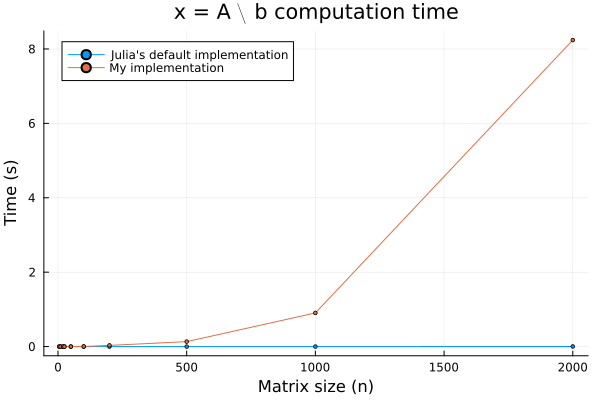
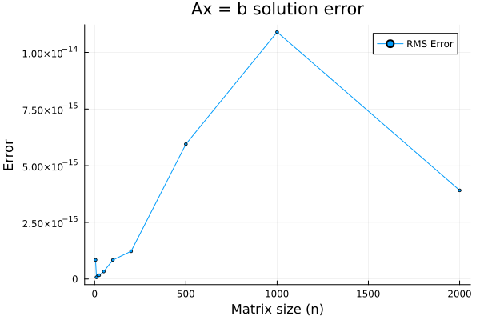
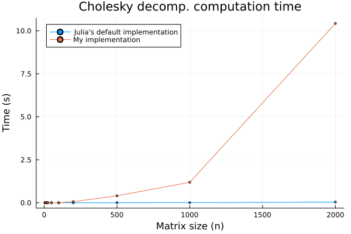
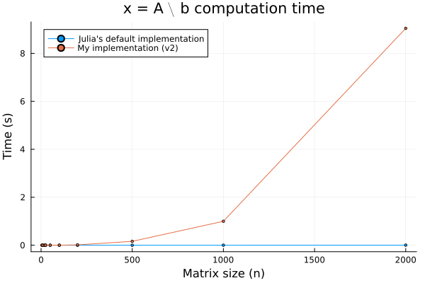
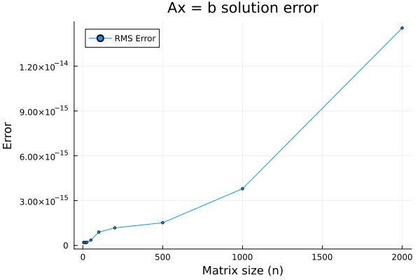
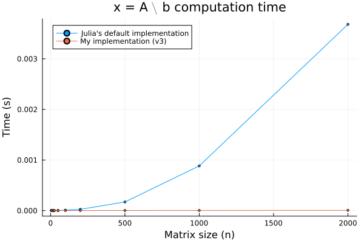
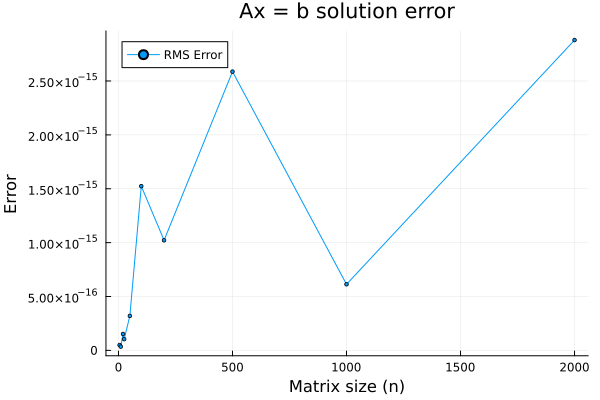

# Cholesky Decomposition

This is my attempt to use [Cholesky decomposition](https://en.wikipedia.org/wiki/Cholesky_decomposition) to solve linear system of equations, `Ax = b` with performance which is close to Julia's native implementation (`A \ b`).

For benchmarking, I am using different `A` and `b` matrix, which are generated using the `rand` function with a seed value of `123`.

## v1 
In this version there is a steep decline in performance, especially for large matrix sizes. However, the implementation is correct as the error is very small:

<p align="center">
  
   
</p>

To determine what is effecting the performance between Cholesky decomposition and the forward and backward substitution steps, I compare the time taken for Cholesky decomposition, by my implementation and Julia's native implementation defined in the `LinearAlgebra` package:

<p align="center">
  
</p>

Clearly, `my_cholesky` is slower. One possible reason could be the nested for loops, leading to `O(n^2)` time complexity. Lets try to optimize it.
## v2

The first observation comes from the inner loop in the lower diagonal matrix calculation: 

```Julia
for i = 2:r
    for j = 2:c
        if i == j
            L[i,j] = (A[i,j] - sum(A[i,1:i-1].^2))^0.5
        elseif i > j
            L[i,j] = (A[i,j] - sum(A[i,1:j-1] .* A[j,1:j-1])) / L[j,j]
        end
    end
end
```

Where `r` and `c` are the row and column size of A respectively. As the inner computation is only performed for ` 1 < j <= i`, it makes sense to reflect these changes to the inner `for` loop:

```Julia
for i = 2:r
    for j = 2:i
        if i == j
            L[i,j] = (A[i,j] - sum(A[i,1:i-1].^2))^0.5
        else
            L[i,j] = (A[i,j] - sum(A[i,1:j-1] .* A[j,1:j-1])) / L[j,j]
        end
    end
end
```

<p align="center">
  
   
</p>

Some progress! however, there still a lot of optimization that needs to be performed.

## v3 
Interestingly, Julia's linear solve function, `\`  calls LAPACK functions to actual computation. Considering the matrix `A` is diagonal, it is very likely that no additional computation is performed except forward substitution to get `x`, taking advantage of the fact that `A` is diagonal, I can actually beat native Julia performance!

```Julia
b / diag(A)
```

<p align="center">
  
   
</p>


